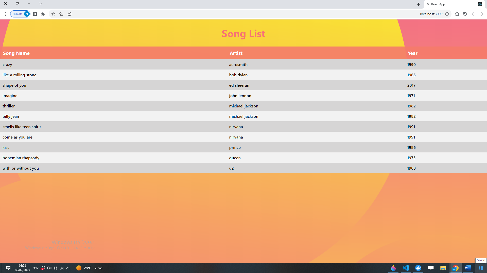

<p align="center">
  <h1 align="center">Song List App</h1>

  <p align="center">
    An application that performs the following tasks:<br /><br />
      1. Parse a CSV file containing song data.<br /><br />
      2. Store the parsed song records into a MySQL database.<br /><br />
      3. Display the songs in a tabular format, sorted by the band's name.
  </p>
    <br /><br />

<h2 style="display: inline-block">Table of Contents</h2>
<ol>
  <li>
    <a href="#about-the-project">About The Project</a>
    <ul>
      <li><a href="#built-with">Built With</a></li>
    </ul>
  </li>
  <li>
    <a href="#getting-started">Getting Started</a>
    <ul>
      <li><a href="#prerequisites">Prerequisites</a></li>
      <li><a href="#installation">Installation</a></li>
    </ul>
  </li>
</ol>

## About The Project

### Built With

- **[React](https://reactjs.org/)**
- **[Nest.js](https://nestjs.com/)**
- **[MySql](https://www.mysql.com/)**

## Getting Started

To run this app follow these instructions.

### Prerequisites

Install latest version of npm

  ```sh
  npm install npm@latest -g
  ```

### Installation

1. Clone the project
   ```sh
   git clone https://github.com/kadurinadav/Song-List-app.git
   ```
2. Go to project directory and run the client and the server as instructed below. 

#### server side
1. Navigate to the server folder:
   ```sh
   cd backend
   ```
2. Install NPM packages:
   ```sh
   npm install
   ```
3. MySQL: You need to have MySQL installed on your system. If you don't have it installed, you can download it from [MySQL Downloads](https://dev.mysql.com/downloads/).
4. Create .env file in server directory.
5. Create database at MySql and add the following varibles according to your settings.
   ```sh
   DB_HOST=your_database_host
   DB_PORT=your_database_port (e.g., 3306 for MySQL)
   DB_USERNAME=your_database_username
   DB_PASSWORD=your_database_password
   DB_DATABASE=your_database_name
   ```
6. Start the server
   ```sh
   npm start
   ```
#### client side
1. Navigate to the client folder:
   ```sh
   cd frontend
   ```
2. Install NPM packages:
   ```sh
   npm install
   ```
3. Start the application
    ```sh
    npm start
    ```


